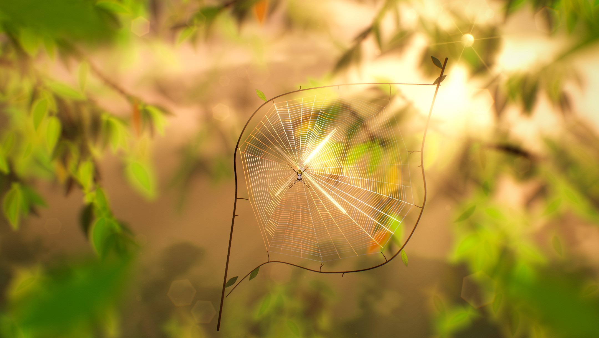
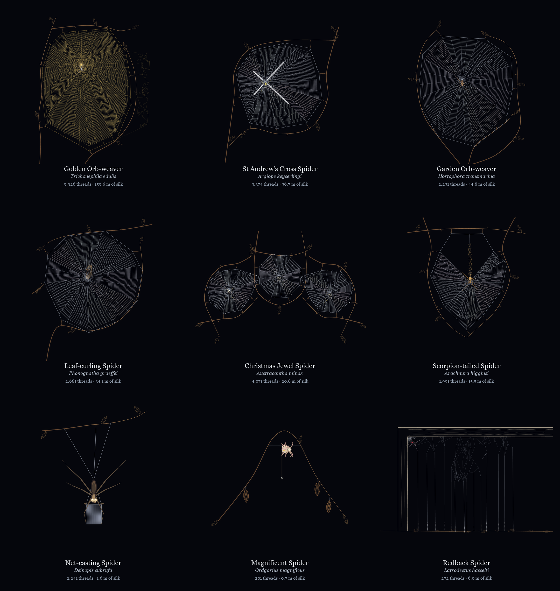
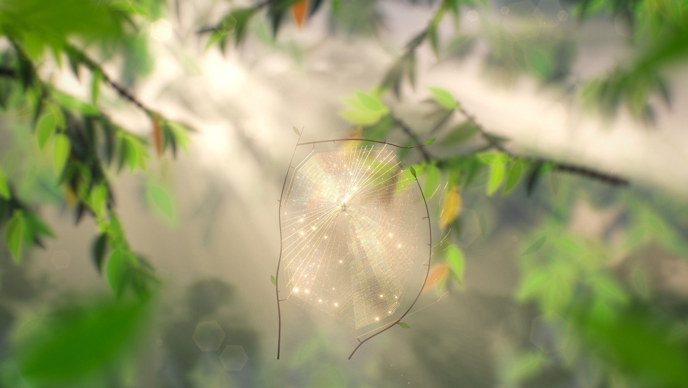
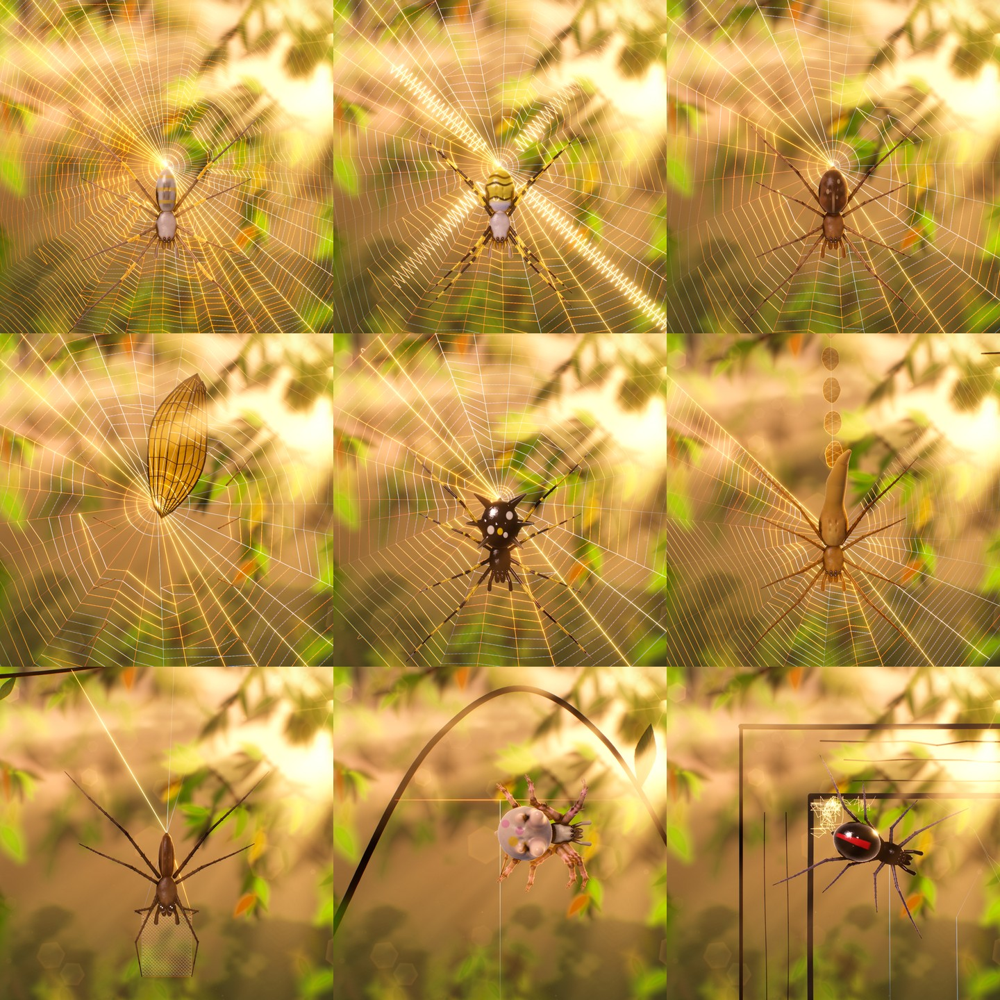
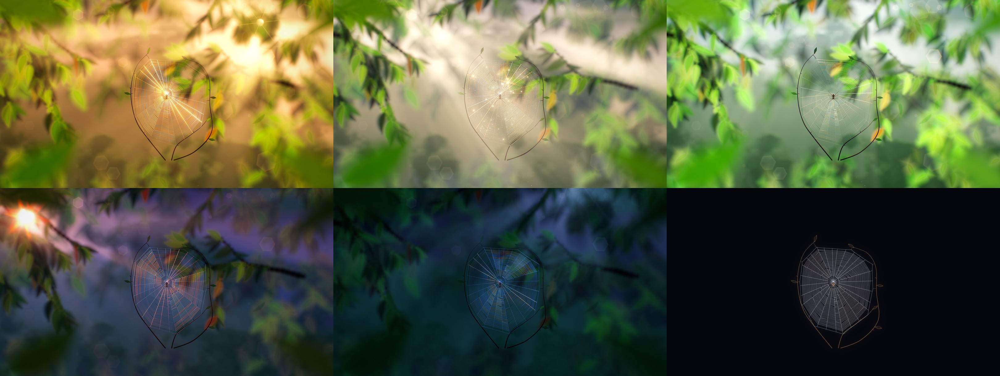

# Spun, Not Drawn

## Thesis

A spider web is not a shape. It is the fossil of a behaviour. A painted web shows the result; this project shows the spider building it. Nine Australian spiders run their species' construction programs thread by thread on a plan graph: bridge, frame, radii, hub, temporary spiral, sticky spiral, decoration, or a snare. Each itinerary is frozen into a compact binary `.silk` record list, which a zero-dependency browser viewer (Canvas2D or WebGL2) replays. She rides the tip of the thread she spins, eats the temporary spiral as the sticky spiral goes in, and settles; then the web stops. In Dawn, dew condenses on the capture silk at the Rayleigh–Plateau spacing.

The viewer draws those records in two looks:

- **Sunlit**, the default on WebGL2, renders them as a backlit macro photograph: sunlight ray-marched through a eucalypt canopy, rainbow-fringed silk, dew drops that refract the scene, and ray-marched 3-D spiders. A Scene panel adjusts every part of it.
- **Classic** is the original line drawing. It is identical in Canvas2D and WebGL2 and in the Python plates.



The nine specimens in the Classic look, at dusk:



The same catalogue at dawn, with dew: [renders/catalogue_dawn.png](renders/catalogue_dawn.png).

## Catalogue

This table is the verbatim output of `.venv/Scripts/python.exe tools/build.py --markdown`, which reads `web/specimens/index.json`.

| Spider | Scientific name | Kind | File | Signature | Rest | Segments | Beads | Silk (m) | Bytes |
|---|---|---|---|---|---|---:|---:|---:|---:|
| Golden Orb-weaver | *Trichonephila edulis* | orb | `golden.silk` | Upper-third golden hub, retained temporary silk, barrier tangle | head-down | 18,020 | 32,000 | 159.6 | 616,432 |
| St Andrew's Cross Spider | *Argiope keyserlingi* | orb | `argiope.silk` | Four zig-zag stabilimentum bands in an X | hub-x | 7,196 | 11,740 | 36.7 | 237,872 |
| Garden Orb-weaver | *Hortophora transmarina* | orb | `hortophora.silk` | Heavy dusk frame, clear free zone and many capture turns | hub-rest | 5,170 | 12,876 | 44.8 | 206,440 |
| Leaf-curling Spider | *Phonognatha graeffei* | orb | `phonognatha.silk` | Rolled leaf retreat near the hub | in-leaf | 5,989 | 15,590 | 34.1 | 244,532 |
| Christmas Jewel Spider | *Austracantha minax* | orb | `austracantha.silk` | Three shared-support orbs with white silk tufts | hub-rest ×3 | 8,990 | 10,415 | 20.8 | 263,152 |
| Scorpion-tailed Spider | *Arachnura higginsi* | orb | `arachnura.silk` | Empty upper V, signal line and seven woolly egg sacs | hub-tail | 6,430 | 7,491 | 15.3 | 188,560 |
| Net-casting Spider | *Deinopis subrufa* | snare | `deinopis.silk` | Small held rectangle of woolly cribellate silk | net | 2,681 | 400 | 1.6 | 56,852 |
| Magnificent Spider | *Ordgarius magnificus* | snare | `ordgarius.silk` | Single bolas globule below the trapeze and spindle egg sacs | hanging | 953 | 143 | 0.7 | 20,236 |
| Redback Spider | *Latrodectus hasselti* | snare | `latrodectus.silk` | Timber retreat, dense tangle and glued gumfoot bottoms | retreat | 1,976 | 499 | 6.0 | 43,544 |

## The Sunlit look

On WebGL2 the viewer opens in the **Sunlit** look. It draws the same frozen records as a backlit macro photograph:

- The web hangs in front of a defocused eucalypt canopy.
- Low sun streams through the leaves in visible shafts and dapples the silk.
- Threads flare in rainbow-fringed highlights.
- Dew beads act as tiny lenses.
- The spiders are ray-marched 3-D models.

**Classic** is the line-drawn look documented above. It stays one click away in the Scene panel, it is the only look on Canvas 2D, and the 2D/GL parity checks still compare it.

| | |
|---|---|
|  |  |
|  |  |

### Controls

- **Scene** (header) opens the settings panel: a side drawer on wide screens, a bottom sheet on phones. Escape closes it; a second Escape clears the stage.
- **Dusk / Dawn** keeps its meaning: dew condenses on finished webs in Dawn. Each mode remembers its own light, and the presets (Golden hour, Misty dawn, Forest noon, Blue hour, Moonlight) apply to the current mode.
- **Zoom**, Sunlit only:
  - The wheel or a pinch zooms toward the pointer, up to 12x.
  - While zoomed, a drag pans and a click without a drag plants under the pointer.
  - `+`, `-` and `0` (fit) work from the keyboard, as do the buttons at the stage's lower right.
  - The web, dew and spiders magnify. The defocused backdrop stays put, which reads as depth.
- Every setting persists in `localStorage["spun-scene"]`. **Copy share link** encodes the settings that differ from the defaults as `#scene=<base64url JSON>`, and opening such a link applies them.

### What can be changed

| Group | Settings |
|---|---|
| Sunlight (per mode) | sun position (a drag pad plus two sliders; the sun may sit off the stage), backlight, brightness, softness (sun size), sun colour |
| Air & sky (per mode) | light-shaft strength and length, mist, sky fill, floating motes, upper-sky, lower-sky and mist colours |
| Leaves & lens | canopy density, leaf size and colour, foreground leaves, depth of field, bokeh strength and size, aperture blades (round, 5–8), a new canopy seed |
| Silk | brightness, iridescence, sheen width, thickness, glue sparkle |
| Dew | when it forms (at dawn / always / never), amount, droplet size, refraction, glints, star points (none, 4, 6, 8), condensing speed |
| Spiders | model (3-D ray-marched or the illustrated glyphs), size, hairiness, gloss |
| Camera | exposure, contrast, saturation, warmth, split tone, bloom, lens flare, chromatic fringe, vignette, film grain |
| Rendering | look (Sunlit / Classic), quality (automatic, low, medium, high, ultra), breeze, renderer (WebGL2 / Canvas 2D) |

"Dew forms" and "Condensing speed" also apply to Classic.

### How it is drawn

`web/gl/sunlit.js` runs a half-float HDR pipeline around the unchanged record VBOs. It needs `EXT_color_buffer_float`; without it, and on Canvas 2D, the viewer draws Classic.

**Coordinates.**
- The world frame is x right and y down in stage pixels, with z toward the viewer.
- The camera eye sits 1.374 stage heights in front of the stage centre, a vertical field of view of about 40°.
- The background works in *h-space*: stage pixels from the top centre, divided by the stage height.
- The sun is placed as a screen position `sunX`, `sunY`. Its direction is the ray from the eye through that point, with z scaled by $2\,\text{backlight}-1$: at 1 the sun faces the camera through the web, at 0.5 it grazes the web plane, and below 0.5 it lights the web from the front.

**1. Canopy** (`canopy.js`, drawn into a mipmapped target that covers the stage plus 0.45 h of margin).
- A seeded generator (mulberry32) grows 3–14 branches from the top and upper sides. They carry alternate pendulous leaves and drooping tip clusters.
- It adds 18–60 dense clusters just above and beside the stage for the sun to shine through, and 10–36 clusters of distant leaves.
- Each leaf is an instanced lanceolate signed distance: half-width $2.62\,W s^{0.55}(1-s)^{0.9}$ along $s \in [0,1]$, with a falcate centreline and a petiole.
- Its edge softness *is* its depth-of-field blur, $\text{mix}(b_{min}, b_{max}, \text{depth})$, so the backdrop needs no blur passes.
- A distant bush is two fbm layers.
- Wind bends branches with a smooth travelling field (both ends of every segment move, so they stay joined) and flutters leaves about their petioles, all in the vertex shader.

**2. Backdrop.**
- A sky gradient falls to shaded undergrowth.
- Around the sun sits a three-term aureole and a disc of 36× sun radiance.
- The canopy composites over it, premultiplied.
- Bokeh are instanced aperture polygons, visible where the canopy's coverage at mip 3 leaves a gap and brighter near the sun.

**3. Light.**
- For each pixel $p$ at a quarter or half of CSS resolution, the shader marches $N$ steps (28 at low, 64 at high, 96 at ultra) toward the sun $s$ through the canopy's transmission $T = 1 - 0.97\,\alpha$:
  $$\text{shafts}(p) = \frac{\sum_i w_i\,T\big(p + \hat d\,L\,t_i\big)}{\sum_i w_i},\quad t_i = \frac{i+\xi}{N},\ w_i = 1 - 0.55\,t_i$$
  Here $\hat d$ points at the sun, $L = \min(|s-p|, 0.25 + 1.6\,\text{shaft length})$, and $\xi$ is interleaved-gradient-noise jitter.
- The same pass cone-traces the sun's visibility on the web plane, which dapples the silk. It samples the canopy $D = 0.42$ h toward the sun at mip $\log_2(0.04\,\text{softness}\cdot D/\text{texel})$, so a larger sun gives softer dapples.
- A 9-tap separable blur hides the jitter.
- In the composite, the scene is dimmed by $1 - 0.12\,\text{mist}$ and the in-scattered light is added:
  $$\text{airlight}\cdot\big(0.12\,\text{shafts} + b^2\big)\cdot\big(0.12 + 0.9\,\text{HG}(\theta;0.72) + 0.25\,\text{HG}(\theta;0.25)\big)\cdot\text{mist}\cdot\text{shafts strength}\cdot 0.7$$
  Here $b = \text{smoothstep}(0.1, 0.55, \text{shafts})$ turns the marched fraction into a beam mask, so beams stand out where the march found open air between shaded stretches. $\text{HG}$ is the Henyey–Greenstein phase function normalised to 1 at $\theta = 0$, and $\theta$ is the angle between the view ray and the sun.

**4. Silk** (`SILK_FS`, the `.silk` record VBO as instanced capsules).
- A thread of tangent $T$ scatters sunlight into the cone where $T\cdot S + T\cdot V = 0$, with $V$ taken per pixel from the eye. That is why a backlit orb shows bright bands through the hub that move as the sun moves.
- The longitudinal lobe is evaluated per RGB channel with a wavelength shift $\delta = (-1, 0, 1)\cdot 0.95\,\beta\cdot\text{iridescence}$, plus a weaker second-order lobe at $2.7\,\delta$. The overlap is white and the fringes are spectral:
  $$M_c = e^{-\frac12\left(\frac{T\cdot S + T\cdot V + \delta_c}{\beta}\right)^2},\quad \text{radiance} = \text{base}\cdot\text{fill}\cdot0.3 + \text{sun}\cdot\text{vis}\cdot\text{brightness}\left(0.1\,\text{base} + M\,(R + TT)\,\frac{0.32}{\beta}\,\text{tint}\right)$$
- The lobe width is $\beta = \text{mix}(0.035, 0.32, \text{sheen})$. Reflection is $R = \tfrac14\sqrt{\tfrac12 + \tfrac12\cos\varphi}$ and forward transmission is $TT = 2.4\left(\tfrac{1-\cos\varphi}{2}\right)^5$, with $\varphi$ the angle about the fibre.
- Stabilimentum, tufts, retreat and cribellate wool scatter more diffusely.
- Capture silk adds glue-droplet glints every 3.4 native px. They average to a constant once droplets are under about 2 device px apart.
- Silk width grows only as $\text{zoom}^{0.3}$: real threads stay hair-fine under a macro lens.

**5. Bark and leaves.**
- `SCAFFOLD` records at alpha 1 are shaded as cylinders, with bark grain and a backlit rim. In this look they are drawn 1.7× thicker.
- `leafMesh.js` refills closed outlines as triangle fans with leaf-local coordinates for veins: scaffold-leaf margins (alpha 0.9), the leaf-curler's hauled leaf (a closed `LEAF` outline at alpha 0.95, shaded dry), and the `EGGSAC` outlines (woolly silk that glows when backlit).
- Each fill fades in over 24 records after its outline closes.

**6. Dew and glue** (`DEW_FS`).
- Each bead is a sphere impostor.
- The shader traces the view ray through both surfaces with Snell's law, using $\eta = 1.329, 1.333, 1.339$ for red, green and blue. The exit ray samples the backdrop at mip 1.5, 0.3 canvas heights behind, so each drop holds a small, inverted, dispersed image of the scene. Refraction blends toward a straight view.
- On top of that:
  - a Schlick reflection of the sky ($F_0 = 0.02$);
  - the sun's specular glint $400\,(R\cdot S)^{900}$;
  - the sun seen through the lens, $60\,(d\cdot S)^{180}$;
  - total internal reflection darkening the rim.
- Glue and the bolas lure use the same optics with an amber tint.
- Dew timing is the Classic clock, scaled by Condensing speed. A second per-bead hash thins it by Amount.

**7. Spiders** (`spiders.js`, `spiderShaders.js`, `spiderModels.js`). Each spider is one screen quad, and a fragment shader sphere-traces a signed-distance model along orthographic rays in the glyph's own millimetre frame (spinnerets at the origin, head toward +x, back toward the viewer).
- **Body.**
  - Abdomen and carapace are the glyph's ellipses, given depth.
  - The head is raised, with eight eyes: the araneid square of medians with lateral pairs, the theridiid double row, or Deinopis's two huge posterior medians.
  - Chelicerae, palps, pedicel and spinnerets complete the body.
- **Species features and patterns.**
  - Features: garden-orb shoulder humps, the jewel spider's six spines, the scorpion-tail, the Magnificent spider's tubercles, sigilla dimples.
  - Patterns are procedural and coloured from the glyph's fills: golden bands, Argiope stripes, a garden-orb folium, jewel spots, redback stripe, and so on.
- **Legs.**
  - The four glyph joints (base, knee, ankle, tip) become seven points: coxa, femur, patella, tibia, metatarsus, tarsus.
  - Knees rise to $z_0 + \max(0.12L,\ 0.42\,|\text{femur}|)$, ankles sit at about half that height, and tarsi touch the web.
  - Swing legs lift their tips on the same alternating-tetrapod phase as the glyph gait.
  - Segments are tapered round cones, raked spines are added once a tibia spans more than 2.2 device px, and each leg has its own bounding sphere for early rejection.
- **Pose.** It comes from the same itinerary as the glyphs (`core/spiderPose.js`): she walks with the gait, eases into her rest pose, and the leaf-curler hides her body and inner legs at rest.
- **Anti-aliasing.** Closest-approach coverage, with shading at the closest point.
- **Lighting.** The scene sun, dappled by the same visibility map; 24-step soft shadows (high and ultra); 5-tap occlusion; a soft bounce key from the upper front; sky reflections on glossy cuticle; translucency from interior signed-distance depth, weaker on the dark, hard-bodied redback and jewel spider and filtered by leg pigment, so dark legs stay dark against the sun while pale joints and bands glow; and a hair sheen.
- **Size and dew.** The net-casting and Magnificent spiders keep 1× size, because their legs hold silk. Dew is not drawn on spiders.

**8. Finish.**
- Foreground leaves are drawn into a quarter-resolution target, heavily defocused.
- Bloom runs over 4–7 levels (13-tap downsample with a soft threshold of 1.0, tent upsample).
- The star filter is a quarter-resolution bright pass, streaked in three Kawase passes per axis. It uses 2–4 axes and a threshold of 7, so only the brightest glints get stars.
- Analytic sun glare adds aperture diffraction spikes (N spikes for even blade counts, 2N for odd), scaled by how open the canopy is around the sun.
- Then lens ghosts, chromatic fringe, exposure, white balance and ACES filmic tone mapping (Narkowicz fit).
- The grade follows:
  - Split tone multiplies shadows toward teal and highlights toward amber, then restores each pixel's luminance.
  - Saturation.
  - Contrast is a power curve about mid-grey, $0.18\,(c/0.18)^{k}$, so it never clips dark channels. A linear pivot at 0.5 would crush every channel below 0.05 to black and strip the blue from the shade.
  - Vignette, grain and dither, and finally sRGB.

**Budgets and invariants.**
- While webs grow, the Sunlit look still uploads no buffers. Canopy, bokeh and mote instances upload once per seed and density; leaf meshes once per specimen; spider poses and the zoom travel as uniforms.
- Render targets are reallocated only on resize or a quality change.
- The loop runs while webs grow, dew condenses or a zoom eases, and continuously while the breeze is above 0. With the breeze at 0 (or under `prefers-reduced-motion`) the stage rests exactly as Classic does.
- Seeking freezes the scene clock and the jitter, so a frozen frame is deterministic, and it survives WebGL context loss pixel for pixel.

| Quality | canopy (× CSS px) | light | steps | bloom levels | stars | spider steps | spider shadows | motes |
|---|---:|---:|---:|---:|:---:|---:|:---:|---:|
| low | 0.22 | 0.25 | 28 | 4 | no | 56 | no | 160 |
| medium | 0.30 | 0.33 | 44 | 5 | yes | 72 | no | 260 |
| high | 0.40 | 0.50 | 64 | 6 | yes | 96 | yes | 340 |
| ultra | 0.55 | 0.50 | 96 | 7 | yes | 128 | yes | 420 |

- **Automatic quality** starts at low on software rasterisers (SwiftShader, llvmpipe), at medium on coarse-pointer handhelds, and at high otherwise.
- It steps down one level when the median frame over two seconds exceeds 24 ms.

## Algorithms

### Builder, plan graph and the frozen-thread invariant

A `Builder` (`spun/builder.py`) stands on a node of a plan graph whose edges are threads plus walkable scaffold. Its API:

- `spin(path, kind, sticky)` lays a thread from her current node. Attaching to the interior of an existing thread splits it in the graph only.
- `walk_to(node)` runs a length-weighted Dijkstra over live silk ∪ scaffold. If no path exists, it raises.
- `remove(threads)` marks threads dead at the current moment.
- `rest(pose, angle)` ends her itinerary.

The build has three stages:

1. **Plan.** Run the species program. This yields the itinerary and the complete topology: every node that will ever lie on every thread, including threads that are later eaten.
2. **Relax.** Solve the surviving orb network (below).
3. **Emit** (`spun/emit.py`).
   - Replay the itinerary with every thread pre-split at all its eventual nodes, in spinning order.
   - Walks become invisible `WALK` records that retrace live sub-records one by one.
   - Removals become death indices.
   - Each node is quantized once, so her steps and every thread endpoint that shares the node are bit-identical.
   - No record is ever rewritten.

Builders never interleave. The validator (`spun/validate.py`, rules 1–9) enforces that she never teleports and walks only on live silk.

### Scaffold

`spun/scaffold.py` builds branches as centripetal Catmull–Rom curves through 4–7 controls, sampled every 8 px. They taper from 7 to 2 px in the bark gradient `#5b3f2a → #8a6a48`, with ±6% value noise from a bark RNG kept separate from the topology RNG. Side twiglets and lanceolate eucalypt leaves (margins, midrib, vein pairs) are added along them.

- **Frame corners.** A corner within 12 px of bark sits on it. Otherwise a short, nearly straight side twig (≤ 105 px) carries it.
- **Redback timber.** The rail, post, grain lines, ground and leaf litter are fixed polylines (`spun/snares.py`).
- **Timing.** Scaffold records are `SCAFFOLD`/`ENV` and are emitted first.

### Orb program S1–S9 (`spun/orb.py`)

- **S1 Bridge.** She spins `A→B` between the two upper anchors.
- **S2 Y.** She walks to `M` at a seeded fraction U[0.4, 0.6] along the bridge. The hub is $H = (M_x + U[-16,16],\ \text{top} + f_{hub}(\text{bottom}-\text{top}))$. She spins `M→H→C` to the lower anchor.
- **S3 Frame.** She closes the polygon `P`.
- **S4 Radii.** Target $n \sim U[\text{radiiMin}, \text{radiiMax}]$; radii are added while the largest gap $> 2\pi/n$.
  - Each candidate is $\theta = \text{mid}(gap) + \mathcal N(0, (0.12\,gap)^2)$, alternating between the left and right halves.
  - A candidate is rejected if it leaves a gap $< 0.45 \cdot 2\pi/|\text{rays}|$.
  - Open sectors are cut out of the gaps first.
  - She walks hub → neighbouring radius → along `P` to $F(\theta)$, then spins $F(\theta)\to H$.
- **S5 Hub.** Three rings at radii `linspace(8, 0.45·r_free, 3)`, as chords between consecutive radii.
- **S6 Temporary spiral.** Laid outward with spacing $s_{aux}$, from $r_{h1}+8$ to $0.90R_k$.
- **S7 Capture spiral.** Laid inward from $0.94R_k$ to $r_{free}$, with $s(d) = \text{lerp}(s_{in}, s_{out}, d/R_k)\,(1+\mathcal N(0,0.08^2))$. Chords are straight.

**Row-laying rule.** Each radius keeps a frontier $f_k$. The candidate on neighbour $k'$ is $f_{k'} \mp s$ (inward/outward).

- She turns back ($dir \leftarrow -dir$) when $k'$ has no room, or when the chord would cross an open sector.
- *Level refinement (implementation):* an inward chord onto an already-visited neighbour whose candidate lies deeper than her own junction by more than $\max(s,\ 0.5\,d\,\Delta\theta)$ also counts as "no room". She turns back, so turnbacks emerge where the frame is deep. They are never scripted.
- If both neighbours are exhausted, she walks to the spoke with the most remaining room from which a chord can actually leave. If that room is $< 2s$, the spiral is done.
- A junction closer than 1 px to an existing node on the same spoke reuses that node.

**Eating.** A temporary chord $(k{:}a \to k'{:}b)$ dies at the record after the capture record that first makes both $f_k \le a - s/2$ and $f_{k'} \le b - s/2$. Survivors die just after S7. Golden removes nothing.

- **S8 Species extras** (below).
- **S9 Rest.** She walks to the hub, leaf mouth or egg string. Her rest point is the end of her last record.

### Species extras and snares

- **Argiope.** Four zig-zag bands on the radii nearest the diagonals, from $r_{h1}+6$ to $0.55R_k$, ±8 px wide, advancing 3.5 px per zig.
- **Phonognatha.** A rolled leaf (`LEAF`, `ENV`, stage "hauling a leaf") is placed about $0.12R$ above the hub after the capture spiral. Eight `RETREAT` stitches bind it to radii.
- **Austracantha.** A colony of three sequential builders.
  - The later two orbs attach corners onto earlier live frame threads.
  - Tufts every $20\,\text{mm}/\text{mmPerUnit}$ (×U[0.75, 1.25]): 6–10 micro-segments, 6–12 px in total.
- **Arachnura.** An upward V (half-angle 28°) holds only the signal line. 5–8 woolly oval egg sacs are strung up it from the hub.
- **Trichonephila.** Golden palette; the temporary spiral is kept at alpha 0.32.
  - A 52–66-point barrier tangle is projected obliquely as $x + 0.32z,\ y + 0.12z$.
  - It is built as a spanning tree plus 2–3 nearest neighbours per point, with three long stays.
- **Deinopis** (`net_casting`). The four net corners are her rest tarsi (legs 0, 1, 4, 5) from `spider.rest_points_px` at heading π/2.
  - A drop line and two stays run from the twig; a Y runs to the upper corners, then the rectangular frame.
  - Rows are ≈4.5 px apart, with 4.5 px zigs of ±1.2 px amplitude.
  - Each row is combed out along the $+0.6$ px miter offset and back along the $-0.6$ px offset: every zig is two parallel `CRIBELLATE` strokes 1.2 px apart.
- **Ordgarius** (`bolas`).
  - The trapeze is the level chord of the arching branch, 45 mm long, found by bisection.
  - A drop line leads to her spinnerets. The `BOLAS` line runs spinnerets → leg-II tarsus → a final 26 px `STICKY` sub-record, which carries the lure.
  - Three spindle egg sacs hang on short stalks.
- **Latrodectus** (`cobweb`).
  - A 100–130-segment random-walk retreat in the rail/post corner.
  - 78–96 tangle points. Every thread starts at an existing node reached by Dijkstra and runs 30–160 px, biased vertical. Depth $z$ gives alpha $0.35 + 0.25z$.
  - 14–18 gumfoot lines are split at 88%; the bottom 12% is a separate `STICKY` record.

### Relaxation (`spun/relax.py`, orbs only)

Each surviving frame, bridge, radius, capture and hub edge is a tension-only spring: slack silk never pushes. Rest length is $L_0=(1-\varepsilon)L_{plan}$.

| kind | ε | k |
|---|---|---|
| frame / bridge | 0.03 | 1.0 |
| radius | 0.02 | 1.0 |
| capture | 0.01 | 0.15 |
| hub | 0.01 | 0.3 |

The update is $v \leftarrow 0.85(v + 0.2F)$, $x \leftarrow x + 0.2v$, with anchors fixed. It runs for ≤ 400 iterations or until $\max|\Delta x| < 10^{-3}$.

The result is accepted only if:
- the displacement is ≤ 3% of the mean radius;
- junction order along every radius is preserved;
- quantization collapses no segment;
- no new crossing appears.

Otherwise the planned coordinates are used unchanged. Snares are not relaxed.

### Colour and shimmer

- Dry silk is `#cdd6e4` and sticky silk `#eaf0f8`. Special colours are in `spun/kinds.py` (`COLORS`).
- The capture shimmer uses light from the upper left, $L=-3\pi/4$ in y-down canvas coordinates. For a chord of direction $\varphi$:

$$w = 0.22\,|\sin(\varphi-L)|^4,\quad h = \operatorname{frac}\!\Big(0.62 + 0.9\,\frac{(\varphi-L)\bmod\pi}{\pi}\Big),\quad rgb = \text{mix}(base,\ \text{hsv}(h,0.55,1),\ w)$$

### Dew and glue (`spun/beads.py`)

**Dew** goes on each maximal chain of touching, same-style, never-dying, non-ENV records:
- Coating radius $R \sim \text{LogNormal}(\ln R_0, 0.18)$.
- Spacing $\lambda = 2\pi\sqrt2\,R \approx 8.89R$ (±10%).
- Primary radius $r_b = \big(3(R^2-a^2)\lambda/4\big)^{1/3}$, with $a = 0.3R$.
- With probability 0.7, a satellite of radius $0.28\,r_b$ sits midway between primaries.

**Dry silk** uses $0.8R$ and 15% placement density; each droplet's volume still uses its own $0.8R$ wavelength, and dry silk gets no satellites.

**Glue:**
- Gumfoot bottoms carry `GLUE` drops.
- The sticky bolas end carries one `GLUE|LURE` bead of radius 8.5 px.
- Glue is reserved before any thinning.

**Budget.** Beads are sorted by (host, t). Above 32,000, primaries (with their satellites) are dropped by CRC32 hash priority; beads are never enlarged.

### LOD (`spun/emit.py`)

Every record gets an importance from 0 to 255:
- 255 for structure, scaffold, leaf, stabilimentum, egg sacs, gumfoot, bolas and retreat.
- 128 for the temporary spiral; 96 for tufts.
- Tangle threads are ranked by length onto 40–255 (longest highest).

**Capture and cribellate rows:**
- Each chord records $\ell$ = its mean $d/R_k$ and a band = spacing / R.
- Per builder, $\text{row} = \operatorname{round}((\ell_{max}-\ell)/\text{median band})$.
- Rows are ranked in van der Corput (bit-reversal) order, and

$$\text{lod} = 1 + \lfloor 254\,(1 - \text{rank}/\text{rows})\rfloor .$$

The viewer skips records with lod below

$$\text{minLod}(detail) = \begin{cases}0 & detail \ge 0.9\\ \operatorname{round}(255(1 - detail/0.9)) & \text{otherwise.}\end{cases}$$

### Pacing and timeline (`spun/pacing.py`)

- Raw time per record is $d_i = \text{len}_i / v + \text{dwell}$, from the kinds table in `spun/kinds.py`. `WALK` records take time.
- ENV time is halved repeatedly until it is ≤ 8% of presented time.
- Cumulative raw time is normalized to $u$ and integrated exactly against the piecewise-linear speed profile `[(0, 0.55), (0.08, 1.0), (0.88, 1.0), (1, 0.45)]`, then scaled to `durationSeconds`.
- The timeline has 512 samples of the fractional cursor at uniform presentation times; `timeline[0] = 0` and `timeline[511] = N`.
- `stages` lists each change of status label with its first record, ending with "at rest". Labels are a pure function of kind.

### Spider glyph (`spun/spider.py`)

Glyphs are authored in millimetres, with the origin at the spinnerets, heading +x, and the spider's left toward −y. Each has:
- body ellipses and polygons, and eyes with catchlights;
- 8 gait frames × 8 legs × 4 joints (alternating tetrapods);
- a rest pose and `strideMm`;
- `scale` (1.0–2.0).

A glyph point lands at $pos_{px} + \text{Rot}(heading)\,(p_{mm}\cdot scale/\text{mmPerUnit})$. Frames interpolate by distance travelled. The viewer overlay and the Python plates draw from the same data in `index.json`.

## The `.silk` format


Version 1 is little-endian. A 32-byte header (`<4sHHHHIIHHHBBB3x`) holds magic `SILK`, version `1`, header/record/bead sizes `32/20/8`, segment and bead counts (u32), canvas width and height (u16), coordinate scale `4` (u16), width scale `32` (u8), zero flags (u8), builder count `1–3` (u8), and three zero reserved bytes. The first record starts at byte 32; beads directly follow the records. Files must end immediately after the beads.

Each 20-byte record (`<4HI8B`) stores x0, y0, x1, y1 in canvas pixels ×4 (u16); its removal index (u32, or `0xFFFFFFFF` if permanent); and eight bytes in this order: kind, width (pixels ×32), red, green, blue, LOD, flags, alpha. Flag bits 0, 1 and 2 mean sticky, environment and invisible; bits 4–5 select the builder. Records are emitted in construction order and never changed by replay.

Each 8-byte bead (`<IHBB`) stores its host record index (u32), fraction along that host ×65535 (u16), radius in pixels ×16 (u8), and flags (u8). Bead flag bits 0, 1 and 2 mean satellite, glue and lure. In-memory NumPy structured dtypes use these exact layouts, so serialization writes header + records.tobytes() + beads.tobytes() without per-record repacking. Coordinates, widths and bead sizes use nearest-even rounding at the stated scales.

**The record layout is the GPU vertex layout.** WebGL2 uploads `new Uint8Array(buf, 32, N·20)` into one VBO per specimen without repacking:

| attribute | type | offset |
|---|---|---|
| `a_seg` | 4 × `UNSIGNED_SHORT` | 0 |
| `a_death` | `UNSIGNED_INT` via `vertexAttribIPointer` | 8 |
| `a_style` | 4 × `UNSIGNED_BYTE` (kind, width, r, g) | 12 |
| `a_style2` | 4 × `UNSIGNED_BYTE` (b, lod, flags, alpha) | 16 |

The birth index is `gl_InstanceID`.

## Rendering architecture

Four renderers draw the same frozen records with the same visibility rules:

- Records $i < \lfloor c\rfloor$ are complete; record $\lfloor c\rfloor$ is drawn to fraction $c-\lfloor c\rfloor$.
- Once $c \ge$ death, alpha fades over `min(fadeRecords, N − death)` records.
- `INVISIBLE` records and records with lod < minLod are skipped.
- Hairline rule: $w_{px}=\max(w\,s,0.55)\cdot dpr$, drawn with radius $\max(0.5w_{px},0.5)$ and alpha $\times\min(w_{px},1)$.

The renderers:

- **Canvas2D** (`web/core/render2d.js`): per-instance buffers sized to the placed bounds, and an append-only permanent layer (never-dying records and glue beads, each stroked once). A separate dew layer and a dynamic layer hold only live and fading temporaries, the tip record and growing beads. Glow is a half-resolution `ctx.filter` blur composited with `lighter`; it is skipped cleanly if `filter` is unsupported.
- **WebGL2** (`web/gl/`): instanced 4-vertex quads expanded 1 px, with analytic capsule-SDF coverage and premultiplied alpha blended `ONE, ONE_MINUS_SRC_ALPHA`.
  - Only uniforms change while webs grow, so there are zero buffer uploads; a debug counter proves it.
  - Glow uses a sharp FBO and half-resolution ping-pong FBOs with a separable Gaussian matched to the Canvas2D σ.
  - On context loss it calls `preventDefault()` and restores from the kept ArrayBuffers.
  - `?nogl=1` or a missing WebGL2 falls back to Canvas2D.
- **Sunlit** (`web/gl/sunlit.js` and its modules, described under The Sunlit look): the WebGL2 backend's default look. It shades the same record and bead VBOs with its own programs inside an HDR pipeline, and draws the spiders itself as ray-marched models.
- **Overlay** (`web/core/overlay.js`): a transparent 2D canvas above either backend draws the spiders from the glyph data. She fades in, walks with the gait, then eases into her rest pose and stops. Her pose comes from `web/core/spiderPose.js`, shared with the 3-D spiders. In Sunlit the overlay stands aside unless the Illustrated spider model is chosen, and it follows the zoom.
- **Python plates** (`tools/render.py`): a third renderer. It draws at 4× supersampling with Lanczos downsampling, the same hairline rule, radius-14 glow at 0.5 (×1.2 in Dawn), beads and the rest glyph.

The rAF loop runs only while something grows, settles, condenses, fades or zooms, or while the Sunlit breeze is above 0. `web/sw.js` precaches the shell, `index.json` and the default specimen. `.silk` files are cache-first, `index.json` is stale-while-revalidate, and navigations fall back to `offline.html`. The cache version is a content hash written by `tools/build.py`. `?look=classic|sunlit` selects a look. `?debug=1` exposes `window.__spun`:
- `plant`, `seek`, `resume`, `setBackend`, `setMode`, `setGlow`, `clear` and `stats`;
- the `settings` store, and `setSceneTime`, `setDebugView` and `zoomTo` for deterministic Sunlit frames. Implementation choices are under Decisions → Viewer and Appearance and build.

## Verification status

Everything under Verified was run on the current code, in a Linux container with no GPU, unless it is marked as an earlier run.

### Verified

- **Python tests:** `python -m pytest -q` → `108 passed`. Coverage:
  - format round-trip within quantization;
  - a must-fail fixture for each validator rule 1–9;
  - every species passes the validator and rebuilds byte-identically;
  - orb, snare and LOD signatures, beads, glyphs, and two catalogue builds into a temp directory;
  - `render.py --video` with ffmpeg removed from `PATH` exits 2 with "--video requires ffmpeg on PATH".
- **Validator on the catalogue:** `tools/build.py` passes rules 1–9 for all nine specimens with no failures.
- **Build determinism:** `tools.build.build()` was run into two separate temporary directories. `index.json` and all nine `.silk` files have identical sha256 between the two builds, and identical to the committed `web/specimens/` files:

| file | sha256 |
|---|---|
| `arachnura.silk` | `7f1ceb09b78559672745f49b4182633a9f7c4f278b72a7faf193208c78df3187` |
| `argiope.silk` | `da0ad6272f374a46a762bd231854897fdd01eeaf4e959a6c1733c213d347b8eb` |
| `austracantha.silk` | `e43263ff02f06cfa695d2b091e821b524980ee596d417d1d24e45dfdf1eae984` |
| `deinopis.silk` | `0744f262c228dd8049362d1b3b79c906cc1cb292ea512051377743d841e99c78` |
| `golden.silk` | `ac51f7b9e09c6b7cbc6c6ef0adbbfaa6ba2398410914bb80c643357666536ce0` |
| `hortophora.silk` | `9c1a9daba5822f35f418f163faf90ab4a51e93f72a04b6847c57502e018b6ba3` |
| `index.json` | `aec455921f9294ceccd9d7352b4fa702a8156cb47b7b0150cc6c3274727f708f` |
| `latrodectus.silk` | `8045beea8889cd7c27855a89b48a36286131cf667f033eb691fd9084ca52117e` |
| `ordgarius.silk` | `27366c81c12a697a5f9aff01e73521262af9c392cbd07be5546a4ee1a75efff3` |
| `phonognatha.silk` | `79b5bc72f6658d89be90e84341cfd7e19fd6809784ace4c853eb01c282e56436` |

- **Budgets** (from the build table):
  - largest file: `golden.silk`, 616,432 B (≤ 640 KiB);
  - catalogue (nine `.silk` files plus `index.json`): 1,987,957 B (≤ 3 MiB);
  - `index.json` (110,337 B) plus the default `argiope.silk` (237,872 B): 348,209 B (≤ 400 KiB);
  - golden sits exactly at the 32,000-bead cap after deterministic thinning.
- **Plates** (earlier run): `tools/render.py` wrote dusk and dawn plates for all nine species plus both catalogue plates in `renders/`. Each plate was opened and critiqued; see Plate notes.
- **Video** (earlier run, on a machine with ffmpeg): `renders/video/ordgarius.mp4` and `.gif` were produced by `render.py --video magnificent-spider` (git-ignored).
- **Sunlit images:** `tools/showcase.py` rendered the five images in `renders/sunlit/` from the live viewer, at 1440×900 and DPR 1.5, on the software renderer described below. Each was opened and reviewed. The review led to three fixes:
  - Contrast now pivots about mid-grey. The old linear pivot clipped the blue out of every shadow, which turned golden hour olive.
  - Golden hour now uses a rosier mist, and moonlight a greyer sky.
  - Backlit legs now show their own pigment instead of the abdomen's tissue colour.
- **Browser checks** (`tools/verify_web.py`, report and screenshots in [web/verification/README.md](web/verification/README.md)): all 24 PASS.
  - **Environment:**
    - Headless Chromium 141.0.7390.37 via Playwright, with no launch flags.
    - There is no GPU, so WebGL2 runs on SwiftShader: "ANGLE (Google, Vulkan 1.3.0 (SwiftShader Device (Subzero) (0x0000C0DE)), SwiftShader driver)".
    - Frame times from this renderer say nothing about GPUs.
  - **Cold load:**
    - 0 console errors and 0 failed requests.
    - Only the shell modules, `index.json` (110,337 B) and `argiope.silk` (237,872 B) were fetched (data budget 409,600 B).
  - **Sunlit is the default look** on WebGL2:
    - Automatic quality chose low on the software renderer.
    - The canopy has 3,386 instances, and the empty stage has a pixel standard deviation of 66.3 (a lit backdrop, not a flat fill).
    - One 3-D spider is drawn, and the glyph overlay stays empty (0 opaque pixels).
  - **Sunlit species:**
    - All nine plant and complete, and each draws its spiders as 3-D models (3 on the jewel-spider colony).
    - With the Illustrated model, no models are drawn and the glyphs return to the overlay.
  - **Sunlit dew:**
    - Golden in Dawn has 0 dew beads while growing and 32,000 once complete.
    - "Never" keeps Dawn dry (0); "always" gives Dusk all 32,000.
  - **Breeze:** at the default breeze the loop runs and the scene clock advances (0.6 s over the probe). At 0, and under reduced motion, the loop stops and the clock holds.
  - **Scene settings:**
    - A change survives reload and presets apply.
    - Out-of-range brightness clamps to 3.
    - Reset all restores the defaults, and corrupt storage falls back to them.
    - A share link (179 characters) round-trips.
  - **Scene panel:**
    - It opens with focus on its title, with 48 controls in 8 groups and none unlabelled.
    - Arrow keys step a slider.
    - Escape closes it, returns focus to the Scene button and leaves the stage as it was.
  - **Sunlit zoom:**
    - The wheel zooms to 4.6×.
    - A click while zoomed plants at exactly the stage point under the pointer (695.1, 341.6).
    - A drag pans without planting, and the reset returns to 1×.
    - Classic ignores the wheel.
  - **All nine species, both backends** (Classic): decoded segment and bead counts equal `index.json`.
  - **Parity** (Classic, stroke-pixel MAD, 2D vs GL, 1280×800, DPR 1; glow off/on, limits 12/14):
    - default (argiope): 6.559/4.747 at 40% and 6.975/6.09 at the end;
    - golden: 6.652/4.931 at 40% and 7.134/8.472 at the end;
    - net-casting: 3.383/3.516 at 40% and 6.646/7.203 at the end.
  - **Zero uploads:** `glBufferUploadsLastFrame` stayed 0 across 120 frames of growth in Classic and 0 across 120 in Sunlit.
  - **Settle-and-stop:** in Classic 2D, Classic GL, and Sunlit with the breeze at 0, `rafActive` is false and `framesRendered` stays constant from 1 s to 1.5 s after completion.
  - **Eating:**
    - Argiope's probed temporary record is visible mid-capture (pixel delta 90 in 2D, 87 in GL) and gone at the end (0).
    - Golden's temporary silk is still present at the end (delta 103 / 93).
  - **Dew and glue:**
    - Golden in Dawn shows 0 dew while growing and all 32,000 beads once complete.
    - Glue is visible in Dusk on redback and magnificent, in both backends.
  - **Cap and fit:** planting 13 webs leaves 12. Webs planted at the four corners sit exactly at the 4 px inset.
  - **Reduced motion:** a new web is complete on the next frame (cursor 7,196 = N) in both backends.
  - **Fallback:** `?nogl=1` runs on 2D with no errors, and the backend choice persists across reload.
  - **Context loss:** the screenshot after restore matches the one before, with a maximum pixel difference of 0 in Classic and 0 in Sunlit.
  - **Offline:** the service worker activates with 29 precached entries. After one online visit, an offline reload plants argiope and golden.
  - **Mobile:** at 390×844 the document is 390 px wide and the chip strip scrolls (0 → 434 px).
  - **Keyboard:** Tab reaches the chips, arrows switch species, Enter plants on the stage, and Esc clears.
  - **Accessibility:**
    - 24 text elements, with a minimum contrast of 6.7:1.
    - 6 radiogroups (spider species, lighting mode, look, dew forms, model, renderer) use roving tabindex, with Home/End.
    - Focus rings are visible, the live region is polite, and the canvas has `tabindex=0` and a label.
  - **Performance** (Classic, 12 growing webs):
    - 2D mean frame times are 22.15 ms (default) and 20.55 ms (golden).
    - GL on SwiftShader takes 1,056 and 1,910 ms. These are software-rasterizer numbers, so no frame-rate claim is made.
- **Earlier hardware run** (commit 3ae2a6d, before the Sunlit look):
  - The 17 Classic checks passed on headless Chromium 153 with ANGLE D3D11 on an NVIDIA GeForce RTX 5070 Ti.
  - There, 12 growing webs held the 60 Hz vsync cap in both backends (16.67 ms mean, p95 ≤ 16.8 ms).

### Not verified

- Sunlit on a hardware GPU: its frame times, the quality level Automatic settles on, and how its images look on real GPUs. Every Sunlit check and image here came from SwiftShader.
- Classic on a hardware GPU since the Sunlit work began. The earlier run predates it. Classic's drawing code is unchanged, but the frame loop it shares with Sunlit is not.
- Safari and Firefox: only Chromium ran.
- Real mobile devices and touch hardware: 390×844 was emulated, and pinch zoom was not exercised.
- A real offline or sleep–wake cycle: offline was emulated with Playwright's `context.set_offline`, and context loss was forced through `WEBGL_lose_context`.
- Frame-time headroom above the 60 Hz vsync.
- Screen-reader output: only ARIA structure and roles were checked.
- Headed (non-headless) browser runs and high-DPR hardware displays other than the emulated ones.

## Documented versus stylized traits

**Documented natural history** (what the programs reproduce):
- Orb construction order: bridge, Y, frame, radii, hub, temporary spiral, then an inward sticky spiral with the temporary spiral eaten. Nephilids (golden) retain the temporary spiral.
- Golden: a high hub and a deep lower half, a barrier tangle, golden silk.
- Argiope: an X-shaped stabilimentum on the diagonal radii, with her legs held in pairs along the arms.
- Phonognatha: a rolled dead leaf hauled into the hub as her retreat.
- Austracantha: a colony of small orbs sharing support lines, with silk tufts about 20 mm apart.
- Arachnura: an open upper sector with one signal line, and egg sacs strung up it.
- Deinopis: a small rectangular cribellate net held in the front four legs, head-down, with huge posterior median eyes.
- Ordgarius: a trapeze line, and a single bolas line ending in one sticky globule; brown spindle egg sacs.
- Latrodectus: a retreat in a sheltered corner, a 3-D tangle, and gumfoot lines whose lowest part carries glue.
- Dew spacing and bead size follow the Rayleigh–Plateau instability of a film-coated fibre.

**Stylized** (chosen for legibility or beauty, not measured):
- Decoration build order; turnback counts and positions (they emerge from the rules, not from observation).
- Spider size exaggeration, 1.0–2.0× (`scale` in each glyph).
- Diffraction shimmer on capture silk.
- Dew and satellite probabilities; dry-silk dew at 15% density; glue bead sizes and the 8.5 px lure.
- Tuft shape (half-ellipse loops); egg-sac hatching, wraps and outlines.
- The zig-zag geometry of the cribellate combing (two strokes 1.2 px apart).
- Every scaffold composition: branches, leaves, twiglets, the redback's timber and leaf litter.
- Frame kinks from relaxation, and relaxation stiffnesses.
- Glow, colour palette and the Dawn gradient.
- Everything specific to the Sunlit look:
  - **Scene and light.** The canopy, bokeh and motes are procedural stand-ins, not a surveyed habitat. The light shafts and dapples come from a 2.5-D model: one canopy layer, shadow rays marched in screen space, and a fixed canopy distance.
  - **Silk optics.** The fibre-scattering lobe positions are physically motivated (the specular cone of a cylinder), but lobe widths, the spectral shift that stands in for thin-fibre diffraction, and glue-droplet glints are tuned by eye. So are bark shading and the filled leaves and egg sacs.
  - **Dew optics.** The two-surface refraction and the Fresnel reflection are real; the backdrop distance, glint exponents and the star filter are photographic choices.
  - **Spider models.** Body depths, leg lift, eye layouts, spines, surface patterns, translucency and all lighting constants were modelled by eye from each glyph and from photographs of the genera, not from measured specimens.

## Decisions

- The checkout directory itself is the project root; the Python package is its direct child `spun/`.
- Header version, sizes, scales, reserved bytes and file length are checked when decoding. The validator maps malformed files to Rule 1 and reports Rules 1–9 by number. Rule 10's byte-identical consecutive-build check belongs with the build tool.
- Validator metadata holds specimen kind, one hub/frame polygon and radial endpoints per orb builder, open-sector angular intervals, the golden flag, 512 timeline cursors, stage boundaries, per-builder spinneret rest positions, and catalogue/index/default asset byte totals. Geometry and rest positions are checked against decoded, quantized records rather than trusting claims of validity in metadata.
- Geometric limits use inclusive CV bounds. The validator reconstructs each possibly kinked radial spoke from decoded radius records; capture endpoints must match actual radial nodes exactly, and spoke drift is bounded by the relaxation displacement allowance plus half a native pixel. Budget KB/MB are interpreted as KiB/MiB.
- Every specimen is paced into its 512-sample timeline during its own build, so the validator checks Rule 8 on the real itinerary. If relaxation violates the displacement, radial-order, crossing or quantized-length conditions, the deterministic fallback is the unchanged planned coordinates.
- Spiral jump targets are only spokes from which a chord can actually leave (so an isolated frontier cannot induce an endless walk). Remaining temporary silk is removed before the final walk. Future open sectors are removed from the angular gaps before proposing new radii.
- Row-laying "no room" also covers level: an inward row refuses an already-visited neighbour whose candidate junction lies deeper than her own junction by more than `max(s, 0.5·d·Δθ)` (the chord would run nearly radial). She turns back, so spokes with more remaining room gain extra rows until the rows are level again. This is what makes golden's lower-half turnbacks, and the concentric rows round every hub, emerge instead of fans of near-radial chords.
- A new spiral junction closer than 1 px to an existing node on the same spoke reuses that node: sub-pixel radial stubs quantize into false crossings (golden retains its temporary spiral, so capture and temporary junctions meet on the same spokes).
- Golden: temporary spiral kept at alpha 0.32 in `#b89a55`. Barrier: 52–66 points in a 170×820×220 px box between the right frame and the right branch, obliquely projected (x += 0.32z, y += 0.12z); a nearest-edge spanning tree (so she always walks on silk) plus 2–3 nearest partners per point, and three long stays to frame anchors; alpha 0.35–0.6 from depth. Golden radii 38–46 and capture 7.4→6.3 px (within ±30%) keep records under 19,000 within the bead budget.
- Specimen `bounds` cover every non-INVISIBLE record, ENV included, plus the rest-glyph extent: the viewer clips its per-instance buffers to them.
- Scaffold branches have a separate deterministic random stream from frame, radii and spiral construction, so editing bark and leaf geometry cannot silently change the orb topology. Spiral first visits use their actual initial radii rather than consuming a spacing step; the capture shimmer is perpendicular to the upper-left light.
- Frame corners come from the scaffold (`frame_polygon(branches)`): a corner within 12 px of a branch sits on the bark; otherwise a short, nearly straight tapering side twig (≤ 105 px, one gentle bend, some forked) carries it. Side twigs are never S-shaped connectors, which read as wires. Each species has its own set piece (golden: leaning sapling + crown bough + ground limb; argiope: one arching stem + a cross stem; hortophora: a three-stemmed shrub; phonognatha: a forked sapling under a crossing twig; austracantha: a U-fork flanked by two bushes; arachnura: two stems meeting in a V under a level twig).
- A spiral junction reached by a jump counts as that spoke's first visit (otherwise a later row could re-lay the identical chord backwards).
- Rule 6's radial-gap CV skips the gaps bordering an open sector (Arachnura's V is signature, not jitter); the same filter is used for reported metrics.
- Colony: each later orb lists `shared` frame corners; they are attached to an earlier orb's live frame thread (pre-split in the plan graph) before she starts. Orb RNG seeds come from `christmas-jewel-spider`, `-2`, `-3`. Tufts are half-ellipse loops from one frame knot out and back to a second knot 2–3 px along, 6–10 segments fitted to 6–12 px, every 20 mm/0.35 = 57 px (×U[0.75, 1.25]); after relaxation their interior follows the mean shift of the two knots.
- Phonognatha's leaf is emitted as LEAF/ENV records after the capture spiral (stage "hauling a leaf"), then 8 RETREAT stitches bind it to radii; free zone 72 px (+29%) so the leaf sits in a clearer hub.
- Every result's metadata carries `anchor` (the hub; the centre web's hub for the colony) and `mmPerUnit`.
- `tools/icons.py` produces the favicon, Apple touch icon and manifest icons under `web/icons/`.
- Scaffold eucalypt leaves and Latrodectus's leaf litter are `SCAFFOLD`/`ENV` records in leaf colours (§4.3 allows SCAFFOLD or LEAF for scaffold). `LEAF` is reserved for Phonognatha's hauled leaf, so status labels stay a pure function of kind: no other specimen's stages ever say "hauling a leaf", and every orb's first silk stage is "bridge line".
- LOD (§4.9): each capture chord records `level` = mean d/R_k of its two junctions and `band` = its spacing / R. Per builder (and kind), rows are `round((max level − level)/median band)`, ranked by bit-reversal (van der Corput) order, `lod = 1 + ⌊254(1 − rank/rows)⌋`. Deinopis's cribellate rows use their row index directly (forward and return strokes share a row). Temporary spiral 128, tufts 96, tangle 40–255 by thread length (longest highest). All other kinds (bridge, frame, radius, hub, retreat, stabilimentum, egg sacs, gumfoot, bolas, scaffold, leaf) are 255; invisible WALK records are 255 (never drawn anyway).
- Snares are not relaxed: their lines are planned at the held/hanging positions (the net must meet her tarsi exactly). Snare metadata is `kind: "snare"`, `anchor` = her rest point (spinnerets), `mmPerUnit`; rules 1–4 and 7–9 apply. Silk lines laid between twig and net/trapeze are FRAME ("framing"); the first drop line and Ordgarius's trapeze are BRIDGE; egg-sac stalks are dry-coloured EGGSAC records.
- Deinopis: head-down (heading π/2) at spinnerets (505, 720); the four net corners are her rest tarsi 0, 1, 4, 5 from `spider.rest_points_px`, quantized once. Rows every ≈4.5 px, zigs 4.5 px long with ±1.2 px amplitude; each row is combed out on the +0.6 px miter offset and back on the −0.6 px offset, so every zig is two parallel strokes 1.2 px apart and she ends each row where it began, then steps down the frame side. Stems: a drop line and two side stays from the twig to her spinnerets; the Y arms run from there to the upper corners.
- Ordgarius: heading 0 (confirmed with the glyph author), so left leg II's rest tarsus (0, +8) mm lies 53 px straight below the spinnerets; the bolas is one BOLAS thread spinnerets → tarsus → glue start, then a separate 26 px STICKY BOLAS sub-record (the lure bead goes at its end); she walks back up to rest at her spinnerets. The trapeze is the level chord of an arching branch found by bisection to be exactly 45 mm. Three spindle sacs (16 outline stations, two crossing wraps). The file has ~950 records, of which ~200 are silk; scaffold sampling and walks along the twig are the rest.
- Latrodectus: the rail is outlined (edges 4 px, 3–5 wavering grain lines) meeting a post whose inner face gives the corner. The retreat is a random walk (6–15 px steps) confined to a corner ellipse and lashed alternately to rail and post. Tangle threads start from existing nodes she walks to: 33% fresh drops from the rail underside, 10% from the retreat, the rest from tangle points; ends are 30–160 px away, biased vertical, with 3-D depth → alpha 0.35–0.6; cross-links and short stays to the rail. Gumfoot feet: the lowest tangle point in each of n x-bands (≥ 14 px apart), dropped to the ground with ±12 px drift.

### Appearance and build

- Spider shapes and all eight gait frames are authored once in millimetres; the browser and plates consume the identical glyph. Their size exaggerations, from 1.0× (Deinopis, Ordgarius) to 2.0× (Austracantha), are a legibility stylization, not measurements. The in-leaf pose exposes only legs from the ankle; the net's four holding tarsi are fixed at (26, ±8) and (46, ±8) mm from the spinnerets. Ordgarius has a stout 21 mm tarsal span, 1.5× her 14 mm body, while left leg II still touches the vertical bolas line at (0, 8) mm.
- Dry-silk dew is 15% as dense as sticky-silk dew and has coating radius `0.8R`; the 15% factor increases *placement spacing only*. Each dry droplet's volume uses the Rayleigh–Plateau wavelength of its own `0.8R` coating, not the sparse placement interval, so dry beads are smaller. Dry dew has no satellites. Dying silk, environment and walks carry no beads; glue hosts carry glue but no ordinary dew. A hash-priority trim preserves primary/satellite pairs and never removes glue.
- The icon source is the reference garden orb's emitted, surviving frame, radii, hub and capture records (not an independent drawing). The favicon keeps selected capture turns intact, coarsens radii, rounds coordinates to 0.1 px and merges strokes into one path per visual style to stay under 10 KiB. Catalogue JSON rounds floats to three decimals; service-worker cache version hashes the sorted path and file contents of every shipped web asset except itself and verification images. Budget units are KiB/MiB.

### Viewer

- Canvas2D: an append-only permanent layer (completed never-dying records and their glue beads, each stroked once) plus a dynamic layer redrawn only when the cursor moves (live/fading temporaries and the tip). Temporaries therefore draw above permanent silk; this z-order difference is accepted. Layer buffers are snapped to whole device pixels so they composite without resampling. If Canvas2D filter blur is unavailable, glow is skipped without affecting the sharp silk.
- WebGL2: the record VBO is the `.silk` record bytes uploaded once per specimen; glue beads use one resolved VBO per specimen. While webs grow only uniforms change. Sharp silk is drawn into a full-resolution FBO, then box-downsampled to half resolution. The Canvas2D blur σ (radius·0.5·dpr half-res px) is matched by n ≥ 2 passes per axis of a 13-sample bilinear-paired Gaussian with σ/√n, where n = max(2, ⌈(2.4σ/12)²⌉) keeps every pass within ±12 texels at 2.4σ. The backend defaults to GL when WebGL2 exists and persists in `localStorage["spun-backend"]`.
- Placement: the specimen anchor stays under the pointer; each side's overshoot of the 4 px stage inset shrinks the web independently, down to a floor of 0.12 × the ideal scale. Only when the floor still cannot fit is the anchor shifted by the minimum per-axis amount needed for the inset. Detail = scale / ideal scale drives the LOD threshold.
- Compositing order (2D, GL and Python plates alike): background → sharp silk (source-over, chronological) → glow added with `lighter` at the glow strength (×1.2 in Dawn). The 2D canvas paints the background itself each frame; each instance's half-resolution glow buffer is padded by ⌈3σ⌉ on every side so the halo is not clipped.
- Dawn: by default ("Dew forms: at dawn") dew (non-GLUE beads) shows only in Dawn and only on completed webs; "always" and "never" override the mode, and "Condensing speed" scales the dew clock. Each web's dew clock starts at the later of its completion and the moment Dawn was switched on, on the virtual clock (so `seek` works). Bead i starts at 2.4 s·u_i (u_i = hash32(i)/2³²) and grows over 0.35 s with an ease-out cubic. A web keeps ticking until 2.75 s after its origin, then stops. Canvas2D bakes fully grown dew into a per-instance dew layer and draws growing dew in the dynamic layer. GL keeps u_i in the bead VBO and tests dew visibility per instance from uniforms. Switching to Dusk clears dew; dew is hidden when detail < 0.35. Glow strength ×1.2 applies stage-wide in Dawn.
- Offline: `sw.js` cache names embed `VERSION`, and old `spun-*` caches are deleted on activate. Install precaches the shell (HTML, CSS, every JS module, the manifest, `offline.html`, favicon and Apple touch icon), `index.json` and the default specimen's `.silk`. `.silk` is cache-first and filled on demand; `index.json` is stale-while-revalidate. Navigations are network-first; offline they fall back to the cached `index.html`, or to `offline.html` when `index.json` is not cached. `?nosw=1` skips registration and unregisters existing workers.
- Hairlines: device width w_px = max(w·s, 0.55)·dpr; the stroke diameter is max(w_px, 1) device px and alpha is multiplied by min(w_px, 1).
- `temporary` holds exactly the records with a death index; never-dying auxiliary silk joins the append-only permanent layer.
- **Sunlit and Classic.**
  - Sunlit is chosen, not forced: it needs the WebGL2 backend and `EXT_color_buffer_float`, and the look falls back to Classic on Canvas 2D or without float targets.
  - The Classic GL path is untouched, so 2D/GL parity is still measured on it.
  - The header's former 2D/GL toggle moved into the Scene panel (Rendering → Renderer, still `#backend-group` and still persisted). The Scene button takes its place, so the header keeps four control groups.
- **Per-mode light.** Dusk and Dawn each keep a light profile (sun and air), and the rest of the settings are shared. That way the header toggle keeps its meaning (dew), while each mode can have its own sky.
- **Breeze and rest.** The breeze animates the canopy, bokeh, motes, shaft jitter and grain; the web itself never sways. At breeze 0, or with `prefers-reduced-motion`, the Sunlit stage rests like Classic.
- **Zoom.**
  - It is a Sunlit view transform: stage = (screen − offset) / zoom.
  - Placement stays in stage coordinates, and planting while zoomed maps the pointer through the inverse.
  - The light map is sampled at un-zoomed positions, so dapples and highlights stay on the silk.
  - The backdrop does not zoom.
  - Silk width scales with zoom^0.3; bark, dew and spiders scale fully.
- **Filled shapes.** They are found from record topology, not from new metadata, so `.silk` and `index.json` did not change for Sunlit. A chain closes as soon as a record ends where it began, because egg-sac hatching can continue from the closing node.
- **Spider size.** The net-casting and Magnificent spiders ignore the Size slider: their legs hold silk (the net's corners and the bolas line), and scaling them would break the contact.
- **Saving settings.** They save on a 150 ms debounce and flush on `pagehide`, so a change made just before navigating away is kept.

## Plate notes

**Hortophora transmarina.** Earlier plates read as a near-regular decagon with a centred hub and hung from wavy connector twigs. Now: ten irregular anchors (29°–52°, ±17%) on a three-stemmed shrub, corners on bark or short straight twigs, hub at 0.40; rows bend round the hub, turnbacks where the frame is deep.

**Trichonephila edulis.** First plate: bright fans of near-radial chords below the hub and a thin barrier chain. Fixes: the level rule (concentric rows near the hub, 117 emergent turnbacks filling the deep lower half), a sapling-and-crown-bough frame, and the barrier moved beyond the right limb as a mesh curtain. Dim retained temporary rows show as darker gold. Small fans remain at the two lower corners.

**Argiope keyserlingi.** Moved off the shared four-branch box: one stem arches over the left and top, a cross stem curls under the right. Four `#f6f9ff` zig-zag bands on the diagonal radii make a lopsided X.

**Phonognatha graeffei.** First plate: the rolled leaf was a faint thin sliver lost in the mesh. Revised: broader leaf (146 px) with six nested curl outlines, midrib and seven vein pairs, mouth down at the hub, eight pale stitches to radii, a wider free zone; she rests at the mouth. Polish: two stems closing into a ring round the web read as a racket. Recomposed: a sapling leans in from the lower left and curves up the right, a crossing twig runs over the top, and one short twig pokes in from the left edge, so the upper-left and lower-left are open. Adjacent R_k differ by ≤ 45 px. The sapling still hugs the lower right.

**Austracantha minax.** Three small orbs, built in turn, in a U-fork with a bush on each side; the side orbs tie one corner onto the centre orb's frame. White tufts every ~20 mm line all three frames (first render: tufts overshot 12 px after relaxation, now fitted and carried with the frame).

**Arachnura higginsi.** First plate: egg sacs were circles set off alternately to each side of the signal line. Revised: seven ovals hung along the line itself with slanted woolly hatching, the spider at the bottom; the upward V (28° half-angle) is empty except for the signal line, rows turn back at its edges. Polish: dense two-spoke sawtooth bands ran along both V edges because the upper corners stuck out (edge spokes 570/515 px vs 454/425 px neighbours, so the edge pair lagged and ping-ponged). The upper side corners moved in to (345, 540)/(860, 540) on re-drawn stems; adjacent R_k near the V now differ by ≤ 20 px (~2s) and the edges show nested whole-row reversals. A short sawtooth remains mid-way along the left edge.

**Deinopis subrufa.** First plate: the net and legs met exactly, but everything was bunched into the middle of the canvas under a low twig. Revised: twig raised 170 px so the long drop line and side stays read as the hanging scaffold; the woolly double-stroked net sits in her four front tarsi below her huge eyes.

**Ordgarius magnificus.** First plates: the arch was so broad that the 45 mm trapeze lay just under its crown and her glyph sat on the bark. Revised: a steeper arch puts the trapeze ~130 px under the crown so she hangs clear, the bolas drops straight through her leg-II tarsus to the glue globule, and the three egg sacs were enlarged (116–132 px) with heavier outlines and denser wraps so they read as brown spindles, not leaves.

**Latrodectus hasselti.** First plate: the tangle grew only out of the retreat, so it was a knot in the corner and every gumfoot fell from the left. Revised: a third of the tangle threads now drop from the rail's underside across the span, gumfoot feet are taken per x-band, and the rail edges/grain are heavier and greyer; the gumfoot bottoms carry the glue beads.

**Spider glyphs.** The first rest-pose contact sheet exposed paired Argiope legs collapsing to four rays; separating the four close pairs restored the recognisable X. The first shipped Argiope plate showed near-black resting legs disappear against the night silk, so leg browns and greys were lightened before rebuilding and reviewing the dusk/dawn plates. Golden's initially rounded abdomen was narrowed before the final pass, leaving her long banded legs and silver-grey body small against the gold orb; Hortophora stays stout at the hub; Phonognatha's body and eyes remain hidden by the leaf, with only tarsal tips visible; Austracantha's three six-spined spiders and Arachnura's upturned tail remain accents, not the subject. Deinopis's exceptional large body looked too round on the net's first plate, so the abdomen and cephalothorax were narrowed to a brown stick above the four net-corner tarsi; her two posterior median eyes read from across the final plate. Ordgarius first read as a harvestman in both catalogues: thickened her short femora, rounded and enlarged her cream abdomen, strengthened its pink/yellow spots and crowned it with visible tubercles. Her left leg-II tarsus still meets the vertical glue-bearing bolas without changing its silk; the redback's red dorsal mark identifies her against the rail. Dawn's satellite droplets roughen capture threads while dry silk stays sparsely and more finely beaded; glue remains legible in dusk.

## Roadmap

Kept out on purpose by the non-goals, and possible later:
- The web swaying in the breeze (only light and leaves move now), and prey capture.
- Web damage and repair.
- Per-plant randomization of the webs themselves (the scene is fully adjustable; each species' web is fixed).
- Image or video export, kiosk or autoplay. Settings can already be shared as a link.
- Sunlit rendering in the Python plates, which stay Classic.
- Audio.
- WebXR, 3-D or mesh export, WebGPU.
- More species (e.g. *Cyrtophora* tent webs, *Poltys*).
- Safari and Firefox verification, real-device mobile testing, screen-reader testing.

## Usage

Windows (PowerShell); other platforms use `.venv/bin/python`.

```powershell
py -3.12 -m venv .venv
.venv/Scripts/python.exe -m pip install -r requirements.txt -r requirements-dev.txt
.venv/Scripts/python.exe -m playwright install chromium   # for verify_web.py

.venv/Scripts/python.exe -m pytest -q                      # format, validator, determinism, must-fail fixtures
.venv/Scripts/python.exe tools/icons.py                    # web/icons/ from the engine's own orb
.venv/Scripts/python.exe tools/build.py                    # all species → web/specimens/*.silk + index.json, sw.js VERSION
.venv/Scripts/python.exe tools/build.py --only st-andrews-cross   # rebuild one, merge into index.json
.venv/Scripts/python.exe tools/build.py --list             # registered species
.venv/Scripts/python.exe tools/build.py --markdown         # the catalogue table above
.venv/Scripts/python.exe tools/render.py --all             # renders/<id>_{dusk,dawn}.png + catalogue plates
.venv/Scripts/python.exe tools/render.py --only redback-spider [--dawn]
.venv/Scripts/python.exe tools/render.py --video st-andrews-cross   # needs ffmpeg; exits 2 without it
.venv/Scripts/python.exe tools/serve.py [--port 8000]      # http://127.0.0.1:8000/
.venv/Scripts/python.exe tools/verify_web.py               # headless checks → web/verification/
.venv/Scripts/python.exe tools/showcase.py [--only hero|dawn|presets|spiders]   # renders/sunlit/*.jpg from the live viewer
```

In the viewer:
- Pick a species, then click the stage to plant it. Escape clears the stage, after first closing the Scene panel if it is open.
- In Sunlit, the wheel or a pinch zooms, a drag pans while zoomed, and `+`, `-` and `0` (fit) work from the keyboard.
