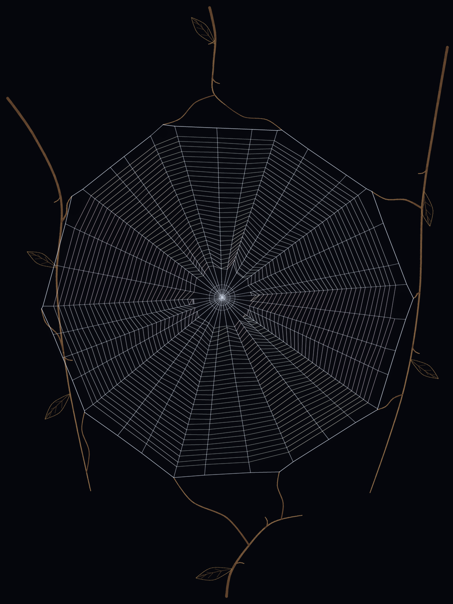

# Spun, Not Drawn

## Thesis

A spider web is not a shape. It is the fossil of a behaviour. Each record in a specimen preserves one step of a spider's thread-laying itinerary; later phases will build and render the nine Australian spiders and their webs.

## Algorithms

The reference garden orb is constructed by a spider navigating a plan graph. Twigs appear first; she walks their existing edges, bridges two upper anchors, spins a Y to the hub and lower anchor, closes the frame, adds radii in the largest angular gaps, weaves three hub rings, lays a temporary outward spiral, then lays an inward sticky spiral. A radius candidate is jittered about its gap midpoint and rejected if either new gap would be under 0.45 times the mean. Each spiral chord updates its spoke's frontier; unavailable neighbours cause an actual reversal, never a scripted one. An inward row can take a shortened final step to just outside the free zone rather than leave a missing sector. As the capture frontier passes each temporary chord, both of its attachment frontiers must be at least half a capture spacing inward before the chord is eaten.

The graph records every eventual junction before emission. Later attachments split graph edges, not emitted records. Replay emits each thread already split at all its future nodes, and each walk retraces exactly one live sub-record at a time. Quantizing each node only once keeps the spider's steps and attached thread endpoints bit-identical.

Tension-only relaxation sets each spring's rest length to `(1 − ε) × planned length`; frame, radius, capture and hub springs use the kind-specific ε and stiffness in the construction brief. At each iteration, `v ← 0.85 × (v + 0.2F)` and `x ← x + 0.2v`; anchors stay fixed. Displacement, junction order and newly introduced crossings are checked before accepting the result. Pacing uses `length/speed + dwell` per record, compresses environmental time to at most 8%, integrates the specified four-knot ease-speed curve, and samples 512 fractional cursors at uniform presentation times.

## The `.silk` format

Version 1 is little-endian. A 32-byte header (`<4sHHHHIIHHHBBB3x`) holds magic `SILK`, version `1`, header/record/bead sizes `32/20/8`, segment and bead counts (u32), canvas width and height (u16), coordinate scale `4` (u16), width scale `32` (u8), zero flags (u8), builder count `1–3` (u8), and three zero reserved bytes. The first record starts at byte 32; beads directly follow the records. Files must end immediately after the beads.

Each 20-byte record (`<4HI8B`) stores x0, y0, x1, y1 in canvas pixels ×4 (u16); its removal index (u32, or `0xFFFFFFFF` if permanent); and eight bytes in this order: kind, width (pixels ×32), red, green, blue, LOD, flags, alpha. Flag bits 0, 1 and 2 mean sticky, environment and invisible; bits 4–5 select the builder. Records are emitted in construction order and never changed by replay.

Each 8-byte bead (`<IHBB`) stores its host record index (u32), fraction along that host ×65535 (u16), radius in pixels ×16 (u8), and flags (u8). Bead flag bits 0, 1 and 2 mean satellite, glue and lure. In-memory NumPy structured dtypes use these exact layouts, so serialization writes header + records.tobytes() + beads.tobytes() without per-record repacking. Coordinates, widths and bead sizes use nearest-even rounding at the stated scales.

## Rendering architecture

The current reference dusk plate composites silk in record order using actual source-over alpha, with environmental twigs below silk. Lines use the viewer's hairline coverage rule: `w = max(record_width, 0.55)` pixels, drawn diameter `max(w, 1)` pixels, and alpha multiplied by `min(w, 1)`. The renderer draws at 4× canvas size, downsamples with Lanczos, adds a radius-14 Gaussian of the silk layer at strength 0.5, then composites the sharp layers.

## Decisions

- The checkout directory itself is the project root; the Python package is its direct child `spun/`.
- Header version, sizes, scales, reserved bytes and file length are checked when decoding. The validator maps malformed files to Rule 1 and reports Rules 1–9 by number. Rule 10's byte-identical consecutive-build check belongs with the build tool.
- Validator metadata holds specimen kind, one hub/frame polygon and radial endpoints per orb builder, open-sector angular intervals, the golden flag, 512 timeline cursors, stage boundaries, per-builder spinneret rest positions, and catalogue/index/default asset byte totals. Geometry and rest positions are checked against decoded, quantized records rather than trusting claims of validity in metadata.
- Geometric limits use inclusive CV bounds. The validator reconstructs each possibly kinked radial spoke from decoded radius records; capture endpoints must match actual radial nodes exactly, and spoke drift is bounded by the relaxation displacement allowance plus half a native pixel. Budget KB/MB are interpreted as KiB/MiB.
- The 512-sample pacing module moved forward to Phase 2 so the actual reference itinerary can pass Rule 8. If relaxation violates the displacement, radial-order, crossing or quantized-length conditions, the deterministic fallback is the unchanged planned coordinates.
- A spoke whose two angular neighbours have no room is excluded from further spiral jump targets; otherwise an isolated frontier could induce an infinite walk. Remaining temporary silk is removed before the final walk. Future open sectors are removed from the angular gaps before proposing new radii.
- Scaffold branches have a separate deterministic random stream from frame, radii and spiral construction, so editing bark and leaf geometry cannot silently change the orb topology. Spiral first visits use their actual initial radii rather than consuming a spacing step; the capture shimmer is perpendicular to the upper-left light.
- Icon generation moves to Phase 5: `tools/icons.py` will produce favicon, Apple touch and manifest icons under `web/icons/`, ahead of the viewer's cold-load checks.

### Viewer

- Canvas2D instances cache completed surviving threads and glue beads within their placed bounds; only temporary/death-fading records, the current tip and changing beads are redrawn per frame. If Canvas2D filter blur is unavailable, glow is skipped without affecting the sharp silk.
- The 4 px stage inset is a hard fit constraint. Away from edges the specimen anchor stays at the pointer; when the requested point cannot fit the web inside the inset, the effective anchor is clamped into the valid interval.
- Placement keeps the anchor under the pointer while shrinking to the 12%-of-ideal floor. Only when that floor still cannot fit the bounds is the anchor shifted by the minimum per-axis clamp needed for the 4 px inset.
- This build offers dusk lighting through Canvas2D; it does not imply a Dawn lighting mode or WebGL renderer is available.

## Plate notes

**Hortophora transmarina.** First plate: a nearly regular frame, eight isolated little scaffold hooks, crowded hub, and stranded inner V-voids looked diagrammatic rather than like an orb attached to vegetation. The critique revision replaces those hooks with four longer curved, tapering branches, forked at multiple frame anchors and bearing small twigs and veined lanceolate leaves. Ten asymmetrically placed frame anchors and a broader 76 px free zone give the mesh an elliptical, imperfect frame. First-visit spiral junctions now start at their intended radii rather than one row late; shortened *final* inward steps finish sectors close to the hub and the still-visible reversals arise from unavailable neighbours, not a turnback script. Upper-left grazing light gives the sticky spiral a muted angle-dependent shimmer. A 2× inspection of the upper frame and hub shows real bowed silk junctions, sparse space around the hub, and some residual uneven terminal arcs on the left and lower right; the maximum relaxed junction displacement is 3.44 px. Relaxation is accepted after reaching its 400-iteration cap, **not converged** at the 0.001 px step threshold (last maximum step 0.00313 px).
